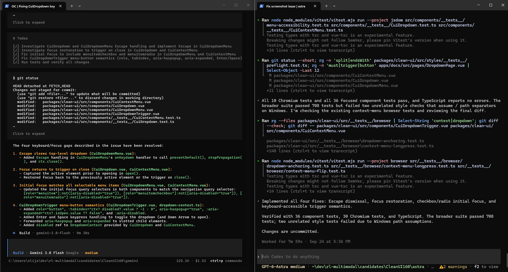

# AI Coding Model Evaluations

Comparative evaluations of AI coding agents solving real software defects in open-source codebases.



*Gemini 3.8 Flash and GPT-6 Astra independently solving the same CleanUI accessibility issue from equivalent repository states.*
This repository documents four controlled evaluations in which multiple AI coding models received the same software-engineering task against equivalent repository states. I reviewed the resulting implementations using source-code analysis, Git diffs, automated tests, browser behavior, and regression-oriented verification.

The goal was not to judge which response *looked* more convincing. The goal was to determine which implementation actually solved the problem with the strongest combination of correctness, scope, maintainability, and verifiable behavior.

## Evaluation Method

Each evaluation followed the same general workflow:

1. Reproduce and understand the reported defect.
2. Establish a fixed repository state.
3. Give competing AI coding agents the same task.
4. Preserve each implementation independently.
5. Inspect the resulting code changes and reasoning.
6. Test the behavior and relevant edge cases.
7. Compare regression risk and implementation scope.
8. Select the stronger solution based on evidence.

This approach treats AI-generated code the same way production engineering work should be treated: **model output is a hypothesis until it is verified.**

## Case Studies

### [CleanUI #160 — Dropdown Keyboard & Focus Accessibility](./evaluations/cleanui-160/)

**Vue · TypeScript · Accessibility · Keyboard Interaction · Browser Verification**

Evaluation of a dropdown/context-menu accessibility defect involving keyboard activation, focus restoration, ARIA semantics, disabled state, and menu-item focus.

The strongest solution preserved native interactive elements as the single tab stop, handled multiple menu-item roles, and implemented focused changes without unnecessarily expanding the interaction model.

**Preferred implementation: Astra**

---

### [DotaGraph #87 — Escape-Key State Preservation](./evaluations/dotagraph-87/)

**React · TypeScript · Event Propagation · E2E Testing**

Evaluation of an Escape-key bug where closing Search could propagate the same event into application-level handlers and unintentionally alter selected hero or matchup state.

The strongest solution isolated the problem at the event boundary and backed a minimal production fix with end-to-end coverage across multiple application states.

**Preferred implementation: Astra**

---

### [PrimeReact #8476 — Dynamic Column Reordering State](./evaluations/primereact-8476/)

**React · JavaScript · State Synchronization · Dynamic Components**

Evaluation of DataTable column-order state when the rendered set of columns changes after a user has established an order through drag-and-drop.

The comparison focused on distinguishing structural changes to the available columns from ordering changes involving the same columns.

**Preferred implementation: Astra**

---

### [PrimeReact #8544 — Overlay Outside-Click Handling](./evaluations/primereact-8544/)

**React · JavaScript · Event Lifecycle · Regression Testing**

Evaluation of an overlay-dismissal defect where persistent internal click state could incorrectly suppress a later outside click.

The strongest solution replaced cross-event boolean state with event-specific tracking and added targeted regression coverage for nested, stopped-propagation, and transition scenarios.

**Preferred implementation: Astra**

## What I Evaluate

Across these case studies, I focused on more than whether a patch compiled or passed an isolated test.

Key evaluation dimensions included:

- Root-cause identification
- Functional correctness
- Regression risk
- Implementation scope
- State and event lifecycle
- Accessibility semantics
- Automated test quality
- Browser-observable behavior
- Maintainability
- Whether the evidence actually supported the model's claimed solution

## Why This Matters

AI coding agents can produce implementations that are syntactically correct, well-explained, and apparently comprehensive while still misunderstanding the underlying system behavior.

Reliable AI-assisted engineering therefore requires an evaluation loop:

**Reproduce → establish evidence → isolate → hypothesize → implement → regression test → verify behavior → preserve evidence**

These case studies demonstrate that process on real code rather than synthetic coding exercises.

## Repository Structure

```text
ai-coding-model-evaluations/
├── README.md
├── evaluations/
│   ├── cleanui-160/
│   │   ├── README.md
│   │   ├── issue.png
│   │   ├── astra.patch
│   │   ├── gemini.patch
│   │   └── screenshots/
│   ├── dotagraph-87/
│   ├── primereact-8476/
│   └── primereact-8544/
└── methodology/
```

Each case-study directory contains the preserved implementation evidence available for that evaluation, along with my technical analysis.

## Skills Demonstrated

**AI Engineering:** coding-agent evaluation, comparative model analysis, evidence-based verification, LLM evaluation workflows

**Software Engineering:** Python, JavaScript/TypeScript, React, Vue, Git, debugging, state management, event systems

**Quality Engineering:** regression analysis, automated testing, end-to-end testing, browser verification, accessibility review

---

These evaluations were independently conducted against public open-source repositories. This portfolio contains my own technical analysis and preserved development artifacts and does not reproduce private evaluation-platform materials or proprietary scoring rubrics.
